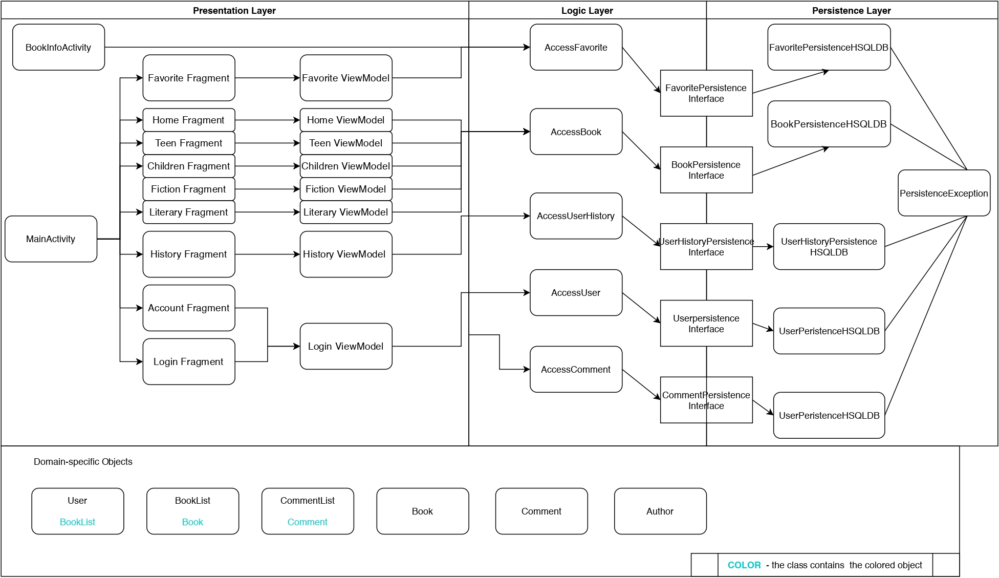

# ARCHITECTURE

## Introduction
The architecture of our application uses a 3-tier architecture model. This is divided into the Presentation, Logic and Database layers (or tiers, as in the diagram). 

## Presentation Layer

The presentation layer interacts with the User Interface to communicate with the user. It is implemented with Android app activities. These allow us to show information to the user and get their input where necessary.

* **MainActivity:** The main activity that shows different fragments depending on the circumstances.
    * **Fragments:**  The pages of the application that are shown on the MainActivity according to the users steps of interaction.
        * **ViewModels:** Provide necessary connections between the Fragments and Logic Layer.
* **BookInfoActivity:** The page where user can see the information about the specific book.

## Logic Layer

This layer processes information between the database layer and the presentation tier. These classes below handle logic in the application.

### Access

This is within the Logic layer and is used by other classes to access the database. The classes under this are:
* **AccessFavorite:** This is used to access FavoritePersistenceInterface.java
* **AccessBook:** This is used to access BookPersistenceInterface.java
* **AccessUserHistory:** This is used to access UserHistoryPersistenceInterface.java
* **AccessUser:** This is used to access UserPersistenceInterface.java
* **AccessComment:** This is used to access CommentPersistenceInterface.java

## Database Layer

The Persistence/Database layer defined below and then implemented by the `DatabaseHSQLDB`, responds to the user and to changes using the Access files in the Logic layer.

* **FavoritePersistenceInterface**  
* **CommentPersistenceInterface**  
* **BookPersistenceInterface** 
* **UserHistoryPersistenceInterface** 
* **UserPersistenceInterface** 

### DatabaseHSQLDB

This is an implementation of the database using HSQLDB. It stores all favourite and userHistory lists of books, books and users. Files under this include:

* **FavoritePersistenceHSQLDB**
* **CommentPersistenceHSQLDB**
* **BookPersistenceHSQLDB**
* **UserHistoryPersistenceHSQLDB**
* **UserPersistenceHSQLDB**
* **PersistenceException:** This handles errors in the classes under DatabaseHSQLDB when it is thrown.

## Domain Specific classes

These are used throughout the app. It contains simple logic and allows to abstract data.

* **Author:** The object to represent an information about an author of the book.
* **User:** The object to represent an information about a user.
* **BookList:**  This contains logic needed to create a list of books and is used among all layers.
* **Book:** This represents a book item and contains its information.
* **Comment:** This represents a comment object and contains the information relevant to it.

----

# A diagram of the 3-tier architecture

This diagram identifies the packages and source files in our repository.
    
