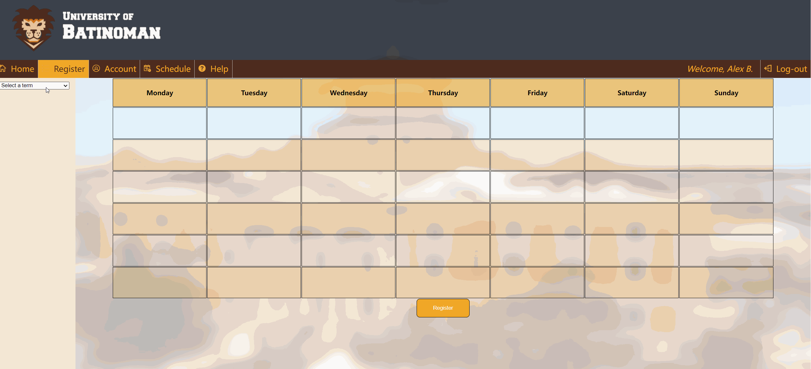
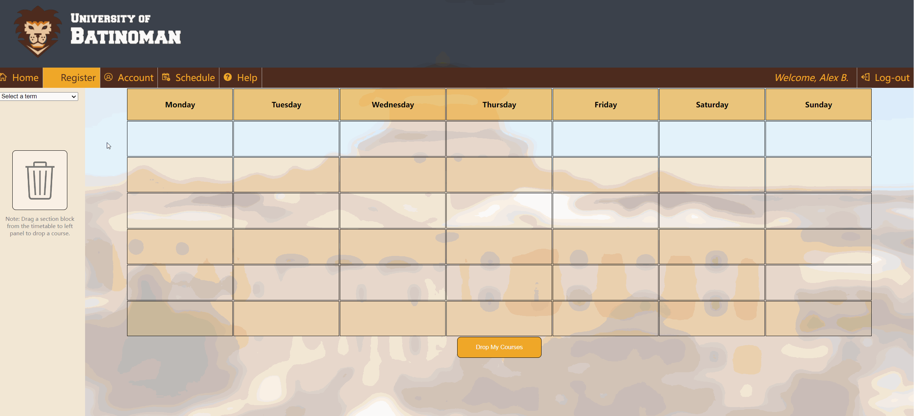

# Course Registration website

The main purpose of this system is to manage university or college courses including checking course availability, registering courses and dropping courses. The main feature of the system is that users can view the actual timetable of courses while they select and register their courses.

There are five tasks could be implemented in the system：
- Browsing courses by different academic term and department
- Checking information of different course
- Checking eligibility of courses
- Adding courses into timetable and registering them
- Dropping courses
- Checking course schedule

Please follow these instruction to successfully run the system.
#### Login

1. MUST always start at index.html. 
2. Enter the CORRECT username and password
    Username: name
    Password: 123
3. Log-in

#### Register course

**You will know that it is unsucceful when you are clicked register after adding a course and the x button did not go away.**
Steps to check if succesful:
1. Go to Register > Add Course
2. Select a Term
3. Drag a section block to timetable
    - you should see an x button
4. Register and accept (by pressing OK)
5. x button should disappear.

#### Drop course

Additional Notes:
    - We did not focused on: (please do not focus evaluating these areas)
        - resetting password functions
        - creating a new account
        - account section
        - actual content on FAQ

    - Known bugs:
        - Navigation icons should change colors when hovered by cursor
        - Back button on section selection to return to course selections
        - some unresposive panels (eg. help page faq and welcome message in homepage
        - When department is selected and it is the same at the durrent department, nothing happens. But it should return to course selection

