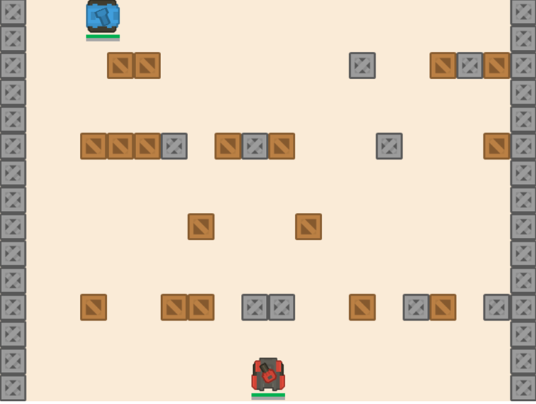
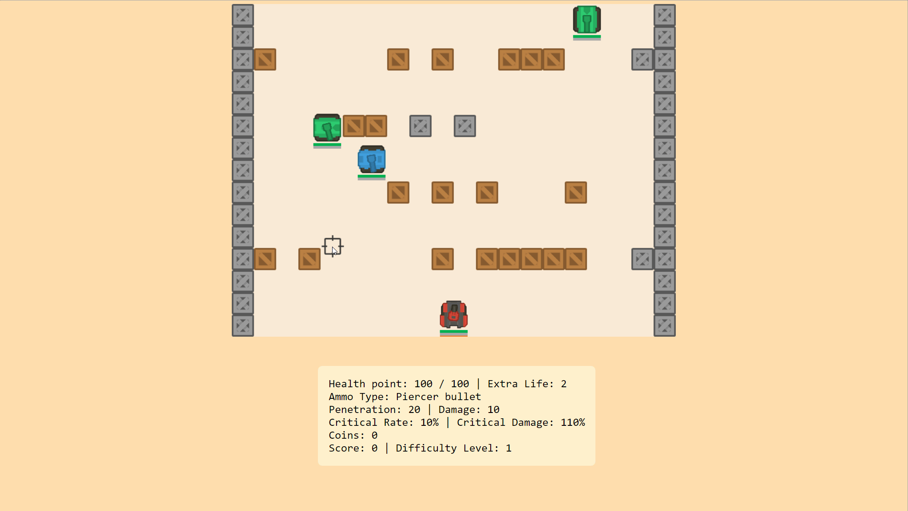

# Tanks Adventure

The player could manipulate a new robot tank “Red Comet” to fight with enemies, it could use the main gun to fire penetrate and burning bullets, and use the machine gun and drones to kill enemies.

### GamePlay:

Control keyboard buttons: 
-	Enter key or Left Shift: start or pause the game
-	W or Up arrow key: go up on the map
-	S or Down arrow key: go down on the map
-	A or Left arrow key: go left on the map
-	D or Right arrow key: go right on the map
-	Space key: fire a cannon, that has a short period of “cooldown” time
-	1,2 or 3 key: switch between two types of ammo

Mouse: 
-	move the mouse on canvas to change the direction of the tank’s turret to try to aim at enemies.
-	Submit button will add player’s nickname, current difficulty level and scores into the record
-	Replay button will start a new game.

### Gameplay Mechanics:

The player’s tanks will be spawned at the center bottom of the game area. All types of enemies could be randomly spawned in the game area. The boss tank will be spawned when the player killed a certain amount of enemy tanks. 
Once enemies are spawned, they will randomly move in up, down, left, and right directions and try to find the player. If there are no blocks in between the enemies and the player, then the enemy will start to move toward the player.

### Game world:

The game world is a scrolling tournament. The player stays at the bottom of the canvas, when the player reaches the 2/3 height of the canvas, the canvas will be scrolling up( everything except the player’s tank will move down on the canvas ).

For more detailed information about this game, please check the file "Game Design Document.pdf".
The game files and all required files are prepared in this folder, please check "Administrator's Manual.pdf" file to install and play the game.

Demonstration

